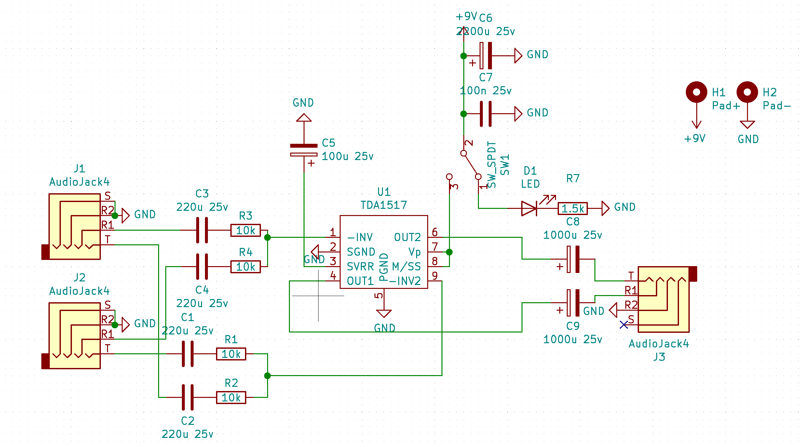
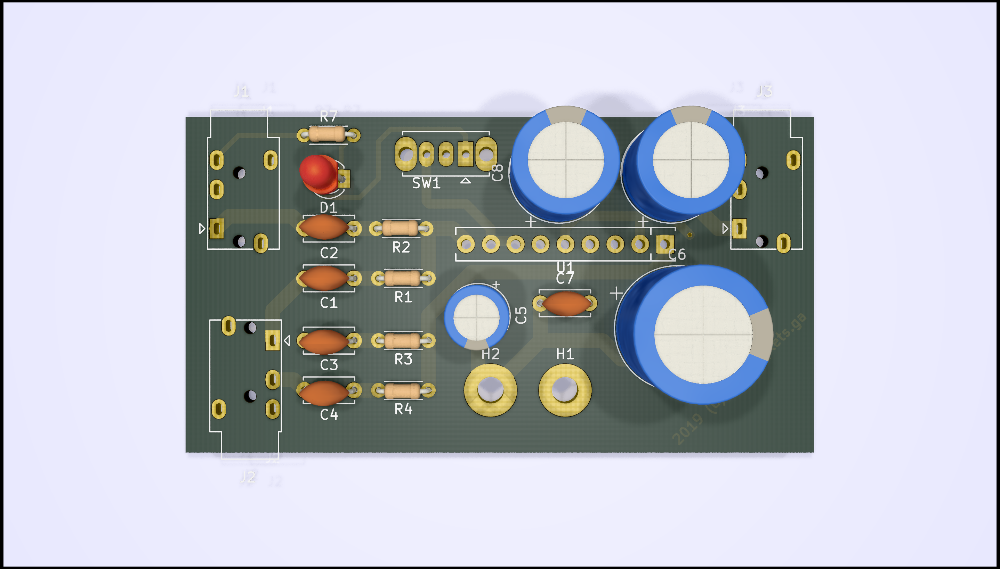

# Audio Combiner/Amp

> Check out the blog post at https://blog.devdroplets.com/stereo-audio-combiner/

This repository contains the KiCAD files for an analog audio combiner (2-stereo signals) with an Class B Amp.
The board is rated up to 18V, but tested on 12V. Excepted power usage at 12V is 3W, though this will depend on your input.
The board is `64.2x34.3x14mm` (smaller than a creditcard in width/height `85.6x54mm`)

The entire board should cost about 13$ (in materials) when produced as one-off; and 7.5$/board when producing in batches of 5; higher quantities should be even cheaper.

# Custom Components/Footprints
This repository contains a custom Lib for KiCAD which includes the TDA1517 (SIP-9) component, which can be reused.
The TDA1517 is a cheap Class B stereo amp, available for 0.17$.

# Screenshots

# License
This hardware is licensed under 
[Creative Commons Attribution 4.0 International License.](https://creativecommons.org/licenses/by/4.0/)

